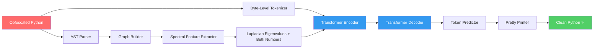

# 🧬 Neural Code De-obfuscator

> **Structure-Aware Neural De-obfuscation Using Graph Spectral Features**

A tool that takes obfuscated, minified, or unreadable Python code and reconstructs it into clean, readable, well-named code — powered by AST graph analysis and a Transformer neural network.

[](LICENSE)
[](https://www.python.org)
[](https://pytorch.org)

---

## 🔍 The Problem

Obfuscated code is everywhere — malware, proprietary software, exploit toolkits, and competitive programming submissions. Existing de-obfuscation tools rely on brittle regex patterns or simple reformatters that cannot recover variable names or understand code structure.

**This project takes a fundamentally different approach:** instead of treating code as text, we treat it as a *graph* and use spectral analysis of the code's Abstract Syntax Tree to understand its deep structure.

## 🏗️ Architecture



### Key Innovation: Graph Spectral Features

Unlike text-based approaches, we extract **topological invariants** from the code's AST:

| Feature | What It Captures |
|---------|-----------------|
| **Laplacian Eigenvalues** | Global structure & connectivity patterns of the code graph |
| **Betti-0** | Number of independent code components |
| **Betti-1** | Number of loops/cycles in the control flow |
| **Node Type Distribution** | Statistical fingerprint of AST node composition |
| **Branching Factor** | Average complexity at each decision point |

These features are **obfuscation-invariant** — renaming variables from `calculate_sum` to `a` changes the text but not the graph topology.

## 📦 Installation

```bash
git clone https://github.com/SoDonik/neural-code-deobfuscator.git
cd neural-code-deobfuscator

pip install -r requirements.txt
```

## 🚀 Usage

### Analyze Code Structure

```bash
python -m src.cli analyze input.py
```

Outputs a rich table showing graph statistics, spectral features, and AST composition.

### De-obfuscate Code

```bash
python -m src.cli deobfuscate obfuscated.py -o clean.py
```

### Example: Before & After

**Before (obfuscated):**
```python
def f(a,b):
 if a<=1:return a
 c,d=0,1
 for e in range(2,a+1):c,d=d,c+d
 return d
```

**After (de-obfuscated):**
```python
def fibonacci(count, second):
    if count <= 1:
        return count
    first, second = 0, 1
    for index in range(2, count + 1):
        first, second = second, first + second
    return second
```

## 📊 Benchmarks

The benchmark suite tests de-obfuscation quality across three difficulty levels:

| Level | Transforms | Description |
|-------|-----------|-------------|
| **1 (Light)** | Rename vars, strip comments | Simple minification |
| **2 (Medium)** | + Compress whitespace, merge statements | Moderate obfuscation |
| **3 (Heavy)** | + Dead code, string encoding, control flow | Aggressive obfuscation |

### Metrics

- **Halstead Complexity** — Vocabulary size, difficulty, mental effort
- **Cyclomatic Complexity** — Number of independent code paths
- **Name Recovery Rate** — % of original names correctly inferred
- **Overall Readability Score** — Composite 0–100 score

Run benchmarks:
```bash
python benchmarks/run_benchmarks.py
```

## 🏋️ Training

Train the Transformer model on the MBPP dataset:

```bash
# Fetch 100 clean functions from Google MBPP dataset
python benchmarks/fetch_dataset.py

# Train for 50 epochs (generates obfuscated pairs on-the-fly)
python -m src.train --data-dir benchmarks/data/clean --epochs 50

# Resume from a checkpoint
python -m src.train --resume checkpoints/best_model.pt --epochs 100
```

Training supports CUDA, MPS (Apple Silicon), and CPU. Checkpoints are saved every 5 epochs + best model.

## 🧪 Testing

```bash
python -m pytest tests/ -v
```

## 🏛️ Project Structure

```
neural-deobfuscator/
├── src/
│   ├── parser/          # Python AST → graph representation
│   ├── features/        # Spectral feature extraction (sparse Laplacian, Betti)
│   ├── model/           # Transformer encoder-decoder (~10M params)
│   ├── reconstructor/   # AST → clean Python + name inference
│   ├── train.py         # Training pipeline (dataset, loop, checkpointing)
│   └── cli.py           # Command-line interface
├── benchmarks/
│   ├── obfuscate.py     # 3-level obfuscation engine
│   ├── metrics.py       # Readability metrics (Halstead, cyclomatic)
│   ├── fetch_dataset.py # MBPP dataset downloader
│   └── data/            # 100 clean + 300 obfuscated test functions
├── tests/               # Unit tests (23 tests)
├── requirements.txt
└── LICENSE (MIT)
```

## 📖 Citation

If you use this work in your research, please cite:

```bibtex
@article{neural_deobfuscator_2026,
  title={Structure-Aware Neural De-obfuscation Using Graph Spectral Features},
  author={Daniyal},
  year={2026},
  note={Preprint available on SSRN}
}
```

## 📄 License

MIT License — see [LICENSE](LICENSE) for details.
